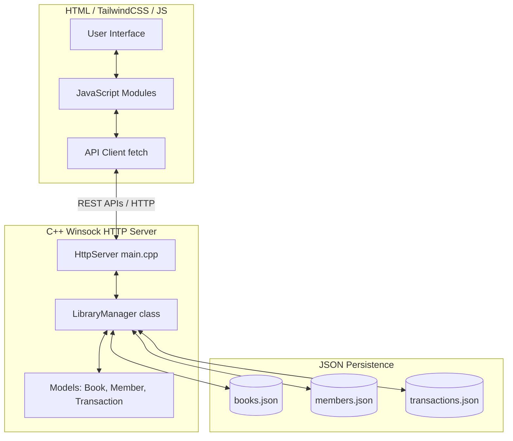
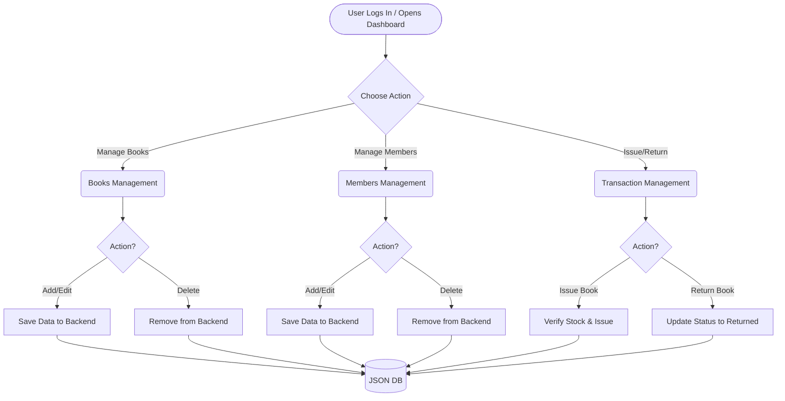

# Library Management System Pro

A comprehensive Library Management System designed with a modern frontend architecture and a robust C++ backend. This project demonstrates Object-Oriented Programming (OOP), file-based data persistence (JSON), and seamless client-server integration.

## 🚀 Features

- **Book Management:** Add, Update, Search, and Delete books. Real-time availability tracking.
- **Member Management:** Register and manage library members. Track total books issued per member.
- **Issue & Return Module:** Handle book borrowing and returns with automated quantity updates and transaction histories.
- **Dashboard Overview:** High-level metrics at a glance using a sleek UI.
- **Modern Aesthetic:** Built with Tailwind CSS, featuring glassmorphism elements, micro-animations, and Dark/Light mode toggle.

---

## 🏗️ Architecture Diagram



---

## 🔀 System Workflow Flowchart



---

## 🛠️ Installation & Running

### Requirements

- **OS:** Windows (For compiling the native Winsock C++ server)
- **Compiler:** g++ (MinGW)
- **Browser:** Any modern web browser (Edge, Chrome, Firefox)

### Step 1: Compile and Run the Backend

1. Open PowerShell or Command Prompt.
2. Navigate to the `backend` directory:
   ```cmd
   cd backend
   ```
3. Run the build script:
   ```cmd
   .\build.bat
   ```
4. If the build succeeds, start the server:
   ```cmd
   .\LibraryServer.exe
   ```
   _You should see `Server starting at http://localhost:8080`._

### Step 2: Open the Frontend

1. While the backend server is running, navigate to the `frontend` folder.
2. Open `index.html` directly in your web browser.
3. You will be redirected to the secure **Login Page**. Use the default Administrator credentials:
   - **Username:** `admin`
   - **Password:** `admin123`
4. (Optional) For the best experience, host the frontend via a local static server like `Live Server` in VS Code, but opening the local file directly works fine because CORS is enabled.

---

## 💻 Tech Stack

- **Frontend:** HTML5, Tailwind CSS, Vanilla JavaScript, FontAwesome
- **Backend:** C++11 (OOP), Raw Winsock API
- **Data Persistence:** JSON (`nlohmann::json`)

---

Developed for educational purposes to simulate a real-world client/server architecture.
